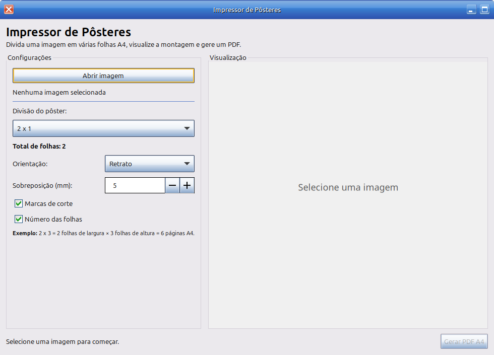

Impressor de Pôsteres — GTK

Aplicativo Linux para impressão de pôsteres em várias folhas A4.

  

##Recursos

- Divisão de 1×1 até 10×10
- Preview visual
- Geração de PDF A4
- Sobreposição configurável
- Marcas de corte
- Numeração das folhas
